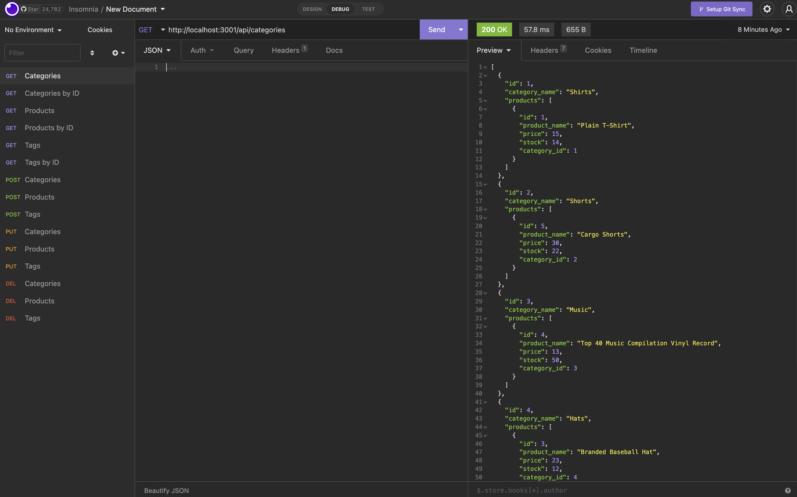

# E-Commerce Backend Data

## Description

This project is a backend database for a test application that organizes various data in MySQL using Sequelize. Throughout this project, I learned a lot about manipulating data in SQL, as well as building models and associations in Sequelize.

## Installation

To install this project, please download the GitHub repository.

## Usage

After installing the GitHub repository, you will need to run a MySQL server and source schema file and the seeds folder. Make sure you have an ENV file. Then, open the terminal and run with "Node index," and test all get, post, put, and delete requests with a tool such as Insomnia.

Additionally, here is a [tutorial video](./Assets/screen_recording.mov) to demonstrate how the application works.

## Credits

AskBCS for helping with questions.

## License

MIT License
